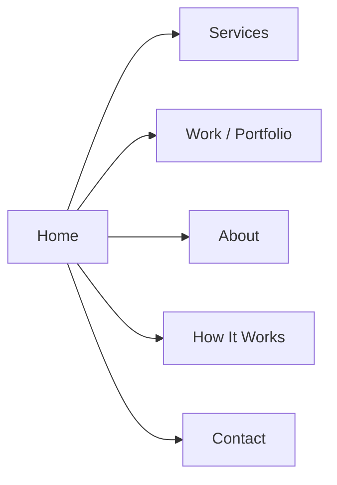

# 🚣 Rowing Club Social Media Agency — Complete Project Analysis

## What Are We Building?

A **portfolio/agency website** for a **rowing-specific social media content agency**. This is a niche creative agency that serves amateur/semi-professional rowing clubs, university rowing programs, and rowing organizations — providing them with consistent, on-brand social media content so volunteer-run clubs don't have to struggle with content creation.

> [!IMPORTANT]
> This is **NOT** a generic web app or SaaS. It is a **single-page (or multi-section) agency portfolio website** — similar in structure to [Zfuence.com](https://www.zfuence.com/) but adapted for the rowing club niche instead of video editing.

---

## The Client's Business (What the Agency Does)

| Aspect | Detail |
|---|---|
| **Industry** | Social media content for rowing clubs |
| **Target Audience** | Amateur/semi-pro rowing clubs, university rowing programs, alumni associations |
| **Core Service** | Monthly content packages: branded static posts, carousels, captions, short-form video edits, content calendars |
| **Key Problem Solved** | Rowing clubs have great stories but no consistent system to publish them. Content usually depends on one overwhelmed volunteer. |
| **Positioning Tagline** | *"Make Your Club Look as Strong Online as It Is on the Water."* |
| **Pricing Range** | ~$350–$500/month per club (not public on site initially) |

---

## Website Structure (from PRD § 2)

The PRD recommends **6 logical pages/sections**:



> These can be built as a **single-page scrolling site** (like Zfuence) or as separate routes — the PRD doesn't mandate one approach.

---

## Section-by-Section Breakdown

### 1. 🏠 Hero Section
- **Eyebrow**: `SOCIAL MEDIA CONTENT FOR ROWING CLUBS`
- **Headline**: *"Your Club Has the Story. We Make Sure People See It."*
- **Subheadline**: Long-form explanation about turning club moments into publish-ready social content
- **Primary CTA**: `Get a Free Club Content Audit →`
- **Secondary CTA**: `See Our Work`
- **Trust line**: *"Built for rowing clubs. Designed around your people, your season, and your goals."*

### 2. 🏷️ Trust Strip / Logo Bar
- **Label**: *"Built specifically for rowing clubs and rowing programs"*
- **Content keywords**: Club stories • Regatta moments • Athlete spotlights • Recruitment content • Alumni and sponsor visibility
- **Client has 10 club logos** to display in a scrolling marquee:
  - Vesper Boat Club, Leander Club, Cambridge Boat Club (USA), Ruder-Club Favorite Hammonia, Sydney Rowing Club, Mercantile Rowing Club, Oxford University Boat Club, Nereus Rowing Club, The Buchintoro Rowing Society, + 1 more

### 3. 😟 Problem Section — "The Content Gap"
- **Headline**: *"Your club is active. Your social media should show it."*
- **3 Pain Cards**:
  1. Posting happens only when someone remembers
  2. Every post looks like it came from a different club
  3. Great stories stay inside the boathouse

### 4. 💪 Why Choose Us
- **Headline**: *"A generalist agency can make a post. We understand what the post means."*
- **6 Benefit Cards**: Rowing context, Club-fit content, Less volunteer work, Handover-proof system, Goal-aligned, Clear monthly scope

### 5. 📋 Services Section
- **Headline**: *"Everything your club needs to stay visible between race days."*
- **9 Service Cards**: Club News, Regatta Content, Athlete Spotlights, Recruitment, Coaching/Education, Community/Alumni, Sponsor Visibility, Short-Form Video, Content Calendar

### 6. ⚙️ How It Works (5-Step Process)
1. Understand the club
2. Build the content plan
3. Create the content
4. Review and refine
5. Keep the rhythm going

### 7. 🖼️ Portfolio / Selected Work
- **Headline**: *"Content that feels like your club—not a template."*
- **4 Portfolio Categories**: Regatta Recap System, Athlete Spotlight Series, Recruitment Campaign, Sponsor Visibility Package
- **Client has ~20 sample social media post images** (branded rowing content graphics from their Facebook/Instagram page)
- **Client has ~13 "Sample with numbers" screenshots** showing content with engagement metrics
- **Portfolio disclaimer**: Label as "Sample Concept" until real clients exist

### 8. 📊 Results / Social Proof
- **Analytics screenshots** (13 images): Instagram/Facebook analytics showing views, reach, engagement rates
- **Social proof screenshots** (33 images): Comments, shares, reposts, and collaborations with popular rowing personalities
- **Athlete spotlights**: Katherine Grainger, Joe Rantz — famous rowing figures used in sample content

### 9. 📦 Deliverables / Pricing Section
- Monthly content packages with defined scope
- Trial framing: 1-month initial trial recommended
- **Pricing kept private initially** (discovery conversation determines final scope)

### 10. ❓ FAQ Section
- 7 questions covering: volunteer-run clubs, photo quality, captions, publishing, turnaround, stopping, existing agency

### 11. 📞 Contact Page
- **Headline**: *"Tell us what your club is trying to make happen."*
- **Form fields**: Club name, Country/region, Website/social profile, Content challenge, Main goal, Content support type, Name, Email, Preferred contact method
- **CTA**: `Request My Club Content Audit →`

### 12. 🦶 Footer
- Agency name, tagline, links (Home · Services · Work · About · How It Works · Contact)
- *"Built for the rowing community."*

---

## Assets Provided by Client

### Directory Structure
```
docs/
├── rowing-prd.pdf                           ← 12-section PRD with all copy & strategy
├── 1. logo of club featured/               ← 10 rowing club logos (PNG)
│   ├── Vesper Boat Club
│   ├── Leander Club  
│   ├── Cambridge Boat Club (USA)
│   ├── Ruder-Club Favorite Hammonia
│   ├── Sydney Rowing Club
│   ├── Mercantile Rowing Club
│   ├── Oxford University Boat Club
│   ├── Nereus Rowing Club
│   ├── The Buchintoro Rowing Society
│   └── Footer logo (transparent)
├── 2. Static Sample worked project/         ← ~20 sample social media graphics (JPG)
│   ├── Various branded rowing content posts
│   ├── Katherine Grainger athlete spotlight
│   ├── Joe Rantz athlete spotlight
│   └── Sample with numbers/                ← ~13 screenshots with engagement metrics
├── 3. SS analytics and view/               ← ~13 analytics screenshots (PNG/JPG)
│   └── Instagram/Facebook analytics dashboards
├── 4. SS Analytics of followers/            ← EMPTY (no files yet)
└── 5. SS comments-share-repost.../         ← ~33 social proof screenshots (PNG)
    └── Comments, shares, reposts from notable rowing people
```

### Asset Summary
| Category | Count | Format |
|---|---|---|
| Club logos | 10 | PNG |
| Sample content posts | ~20 | JPG |
| Content with metrics | ~13 | PNG |
| Analytics screenshots | ~13 | PNG/JPG |
| Social proof screenshots | ~33 | PNG |
| Follower analytics | 0 (empty) | — |
| **Total image assets** | **~89** | — |

---

## Reference Website Analysis — Zfuence.com

The reference site (Zfuence.com) is a **dark-themed, single-page agency website** for a white-label video editing service. Key design patterns to adapt:

### Visual Theme
- **Color scheme**: Deep dark (`#07080f`) background with light text
- **Typography**: Geist (headings) + Inter (body) — modern, clean sans-serif
- **Aesthetic**: Dark, premium, high-contrast with noise texture overlay
- **Feel**: Professional, bold, confident

### Structural Patterns to Borrow
1. ✅ **Sticky nav** with logo + section links + CTA button ("Book a call")
2. ✅ **Hero** with pill badge ("spots available"), bold headline, subheadline, CTA
3. ✅ **Scrolling marquee** (text ticker)
4. ✅ **Logo strip** — infinite-scroll brand logos
5. ✅ **Client wall** — ranked client cards with photos + follower counts
6. ✅ **VSL / Video embed** in the hero area
7. ✅ **Social proof** — avatar stack + star ratings
8. ✅ **Mobile hamburger menu**
9. ✅ **Reveal animations** on scroll

### What to Adapt (per PRD § 11)
- Borrow: hierarchy, contrast, bold CTAs, process cards, proof-led sections
- **Don't copy**: revenue claims, follower-growth claims, trademarked framework names
- **Visual direction should feel**: calm, athletic, disciplined, community-oriented
- **Avoid**: looking like a generic SaaS or creator agency

---

## 🔍 Critical Findings from Image Review

> [!IMPORTANT]
> The image review revealed that the agency **already exists and is actively operating** with established branding, a large audience, and real engagement from Olympic-level figures.

### Agency Identity (Discovered from Images)
- **Primary Brand Name**: **"Oar & Blade"** — with a crossed blades silhouette logo
- **Secondary/Platform Name**: **"Golden Oars"** — appears on analytics dashboards
- **Brand Palette**: Red/crimson accent + charcoal/black + white — premium sports editorial aesthetic
- **Content Style**: Nike/ESPN-tier athlete profile graphics, historical infographics, motivational quote posters

### Proven Metrics (from Analytics Screenshots)
| Metric | Value |
|---|---|
| **Monthly Views** | **3.2 Million** (+86.8% growth) |
| **Monthly Interactions** | **31.6K** (+63.6% growth) |
| **Top Single Post Views** | 247K views |
| **Best Comment Engagement** | 292 comments on a single post |
| **Daily View Peaks** | 300,000+ views/day |

### Real Social Proof (from Screenshots)
- **Adrian Ellison** (Olympic Gold Medallist coxswain, 1984 LA Games) — actively comments on posts
- **Alix James** (former CEO of Nielsen-Kellerman / NK Sports) — leaves detailed insider comments
- **Castle Dore Rowing Club** (UK) — officially reposts content with attribution
- Hundreds of coaches, masters rowers, and club officials actively debate in comments

### Content That Works (Sample Posts with Metrics)
| Post | Reactions | Comments | Shares |
|---|---|---|---|
| "King and Queen of Rowing" (Redgrave + Lipă) | 492 | 47 | 68 |
| "Legends of Rowing" (9-legend poster) | 436 | 176 | 26 |
| "Legendary Coaches" (mention your favorite) | 226 | **292** | 14 |
| "Leander Club" deep dive | 183 | 26 | 28 |
| "Berlin 1936" (Boys in the Boat) | 1,400 | 190 | 110 |

---

## Key Design Decisions Needed

> [!NOTE]
> These are questions we'll need to resolve as we build:

1. **Agency name confirmation** — Images show "Oar & Blade" branding. Is this the final name for the website?
2. **Single-page scroll vs. multi-page** — PRD lists 6 pages but Zfuence is single-page
3. **Tech stack** — Not specified (vanilla HTML/CSS/JS like Zfuence? Or React/Next.js?)
4. **Founder credibility section** — PRD mentions it but no founder bio/photo provided
5. **Pricing visibility** — PRD says keep pricing private initially
6. **Video content** — Should there be a VSL/showreel video embed?
7. **Color palette** — The existing brand uses red/charcoal; Zfuence uses dark navy. Which direction?
8. **Contact form backend** — Just frontend or needs a form submission service?
9. **Booking integration** — Calendly or similar for discovery calls?

---

## Summary

We're building a **premium, dark-themed agency portfolio website** for a niche social media content agency that serves **rowing clubs worldwide**. The site needs to:

1. **Clearly communicate** what they do and who they serve (first screen)
2. **Show credibility** through club logos, sample work, analytics, and social proof
3. **Explain the process** to reduce perceived risk for volunteer-run clubs
4. **Drive conversions** via "Free Club Content Audit" and "Discovery Call" CTAs
5. **Feel calm, athletic, and disciplined** — not like a generic SaaS/creator agency

The PRD is extremely detailed with **all copy written** — our job is to design and build the website using this copy, the provided image assets, and the visual inspiration from Zfuence.com.
